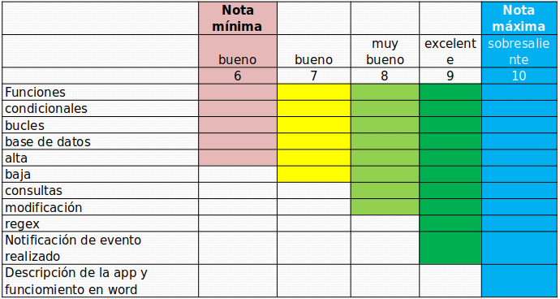

# Diplomatura en Python - Nivel Intermedio - Proyecto Final
Proyecto final de la Diplomatura en Python (Nivel 1), impartida por la Universidad Tecnológica Nacional.

## Integrantes
- Gonzalo Montalvo | [@GonzaloMartin](https://github.com/GonzaloMartin)
- Matias Falconaro | [@MatiasFalconaro](https://github.com/matiasfalconaro)

## Pautas del Proyecto

### Objetivo
El objetivo de este proyecto es consolidar y aplicar los conocimientos adquiridos durante el Nivel Inicial de la Diplomatura. (Ver alcance de la aplicación).

### Alcance de la Aplicación
El proyecto incluye las siguientes unidades, en las cuales se aplicarán los temas abordados durante el curso:

### Detalles de las Unidades

El proyecto consta de la entrega de una aplicación con las siguientes características:

- **Unidades 1 a 5**: Toma de datos.
- **Unidades 2 a 5**: Uso de funciones, condicionales y bucles.
- **Unidad 6**: Uso de base de datos (SQLite3, a elección).
  - Creación de base de datos y tablas desde Python.
  - Alta de registros en la base de datos, solicitando al usuario ingresar datos a través de un formulario de ventana (con el paquete Tkinter).
- **Unidad 7**: Implementación de regex para la validación de uno de los datos tomados en la unidad 6. Realización de ABMC (CRUD en inglés) (Alta, Baja, Modificación, Consulta).

### Entrega Parcial (Unidad 5)

Esta entrega sirve para revisar una propuesta de aplicación que se validará con los profesores. Tras la aprobación, se procederá con el desarrollo a partir del mockup. La entrega parcial no es calificada y se presenta en el foro de la unidad 5.

### Entrega Final (Unidad 8)

## Ejecución del Proyecto

### Dependencias

Para instalar las dependencias:
`pip install -r requirements.txt`

### Ejecutar el Proyecto

Para correr el proyecto:
`python app/proyeto_final.py`