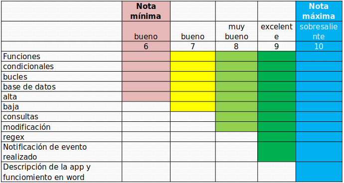

# UTN-Python-TP1
TP de la Diplomatura en Python (Nivel 1).  Luego le cambiamos el nombre.

## Objetivo
Probar los conocimientos adquiridos y que el alumno comience a pasar de la teoría a la práctica.

## Alcance de la aplicación
Consta de la entrega de una app a la cual se le irán agregando:

Unidad 1 a 5 – Toma de datos

Unidad 2 a 5 – Uso de funciones, condicionales y bucles.

Unidad 6 – Uso de base de datos (SQLite3 a elección).

Creación de base de datos y tablas desde Python.
Realizar un alta de registro en la base de datos solicitando al usuario que ingrese los datos ya sea mediante consola si solo se utiliza Python o mediante campos del tipo Entry si se utiliza Tkinter.

Unidad 7 : Implementación de regex para validación de uno de los datos tomados en la unidad 6, realización de abmc (crud en ingles) (alta, baja, modificación, consulta)

## Entrega parical (Unidad 5)
Esta entrega es a los fines que chequear el trabajo de cada alumno y poder brindar ayuda en el caso de que se note que el alumno o los alumnos no están participando. No es considerada con nota.

La presentación se realiza en el foro de la unidad 5

## Entrega final (Unidad 8)

